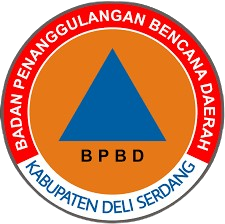

# Sistem Pendukung Keputusan BPBD Deli Serdang

<p align="center">

</p>

## Tentang Aplikasi

Sistem Pendukung Keputusan (SPK) untuk Alokasi Sumber Daya Multi-Bencana BPBD Deli Serdang adalah aplikasi berbasis web yang membantu dalam pengambilan keputusan penanganan bencana dengan menggunakan metode AHP-TOPSIS. Aplikasi ini memiliki fitur-fitur sebagai berikut:

### Manajemen Bencana
- Pengelolaan data bencana
- Monitoring kejadian bencana
- Pemetaan sebaran bencana

### Manajemen Sumber Daya
- Pengelolaan data personel
- Inventarisasi peralatan
- Manajemen dana bencana

### Sistem Pendukung Keputusan
- Perhitungan menggunakan metode AHP (Analytical Hierarchy Process)
- Analisis menggunakan metode TOPSIS
- Penentuan prioritas penanganan bencana
- Rekomendasi alokasi sumber daya

## Teknologi yang Digunakan

- Laravel 10.x
- PHP 8.1
- MySQL Database
- Tailwind CSS
- Alpine.js
- Laravel Vite

## Instalasi

1. Clone repository
```bash
git clone https://github.com/username/bpbd.git
cd bpbd
```

2. Install dependencies
```bash
composer install
npm install
```

3. Setup environment
```bash
cp .env.example .env
php artisan key:generate
```

4. Konfigurasi database di file .env
```env
DB_CONNECTION=mysql
DB_HOST=127.0.0.1
DB_PORT=3306
DB_DATABASE=bpbd_db
DB_USERNAME=root
DB_PASSWORD=
```

5. Migrasi database
```bash
php artisan migrate --seed
```

6. Compile assets
```bash
npm run dev
```

7. Jalankan aplikasi
```bash
php artisan serve
```

## Struktur Modul

- **Dashboard**: Monitoring realtime kejadian bencana
- **Manajemen Bencana**: CRUD data bencana
- **Sumber Daya**: Pengelolaan personel, peralatan, dan dana
- **SPK**: Kriteria, alternatif, perhitungan AHP-TOPSIS

## Pengembang

Aplikasi ini dikembangkan oleh [Arya Dwi Utama] untuk BPBD Kabupaten Deli Serdang.

## Lisensi

Hak Cipta © 2025 BPBD Deli Serdang. All rights reserved.
